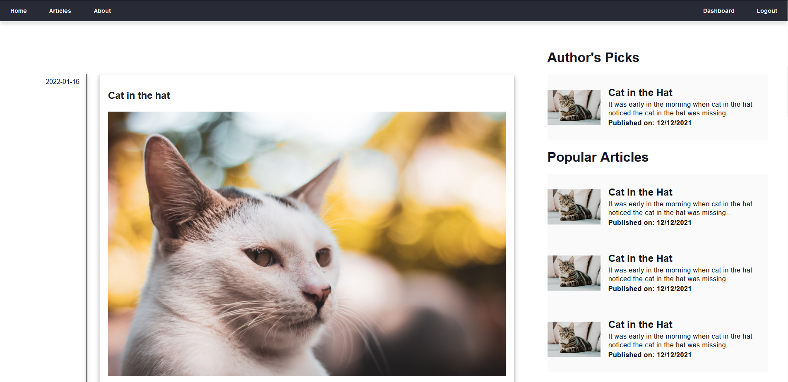

# FastAPI Blog

A modern, high-performance blog application built with FastAPI, featuring async operations, JWT authentication, and comprehensive API documentation.



## 🚀 Quick Start

Get up and running in minutes:

```bash
# Run the automated setup script
./scripts/setup.sh
```

Or manually:

```bash
# Install dependencies
./scripts/install_dependencies.sh

# Set up environment
cp .env.example src/.env
# Edit src/.env with your database credentials

# Initialize database
cd src && python init_app.py

# Start the application
uvicorn main:app --reload
```

Visit http://localhost:8000 to see your blog in action!

## 📋 Features

- **Modern FastAPI Framework**: High-performance, async-first web framework
- **JWT Authentication**: Secure token-based authentication
- **Interactive API Documentation**: Auto-generated API docs at `/docs`
- **User Management**: Registration, login, and user dashboards
- **Article Management**: Create, edit, delete, and view articles
- **Responsive Design**: Mobile-friendly interface
- **Type Safety**: Full type hints throughout the application
- **Security First**: Protection against common vulnerabilities


## 🏗️ Architecture

- **FastAPI**: Modern Python web framework
- **MySQL**: Database with async aiomysql driver
- **JWT**: Token-based authentication
- **Pydantic**: Data validation and serialization
- **Jinja2**: Template engine for web pages

## 🐳 Docker Deployment

```bash
docker-compose up -d
```

Access the application at http://localhost:8000 and phpMyAdmin at http://localhost:8080.

## 📚 API Documentation

Once running, explore the interactive API documentation:
- **Swagger UI**: http://localhost:8000/docs
- **ReDoc**: http://localhost:8000/redoc

## 🧪 Testing

```bash
./scripts/run_tests.sh
```

## ⚙️ Configuration

Set your environment variables in `src/.env`:

```env
DB_HOST=localhost
DB_PORT=3306
DB_USER=root
DB_PASSWORD=secret_pass
DB_NAME=blog_db
SECRET_KEY=your-secret-key-here
```

## 📄 License

MIT License - see [LICENSE](LICENSE) file for details.

---

For detailed documentation, see [README-FastAPI.md](README-FastAPI.md).
